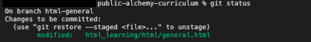

# html-css-js-curriculum

## リポジトリの利用方法

  
ダウンロード（Fork）して利用

1. 「Fork」を押す

   

2. 「Create Fork」を押す

   

3. Fork した「public-alchemy-curriculum」の「<> Code ▼ 」を押す

   

4. clone リンクをコピーする

   

5. ターミナルで`git clone git@github.com:XXXXXXXX/public-alchemy-curriculum.git`　を打ち込み、「ENTER」を押す

   ※ XXXXXXXX は Github のユーザネームが入ります

   ※ `git clone `の後に 4. でコピーしたものをペーストすると上記のコマンドになります

   

   ローカルに「public-alchemy-curriculum」フォルダが作成されていれば、clone が成功しています

   

## 課題を実施する前に下記内容を確認する

- [ディレクトリが作成されているか](https://www.notion.so/alchemy-inc/d39c7c0e8dce4ddfa049a1ea99e1e29f)
- 各課題の Issue が作成されているか（リポジトリの Issue タブを確認）
- Milestone が作成されているか（リポジトリの Issue タブから Milestone を押下）

## 課題について

コンテンツは 3 プログラム構成で実施していきます。

- `HTML-CSS`：全ての基礎となるマークアップを身につけるプログラムです。

- `JavaScript`：現代では必須となった JavaScript を現場ライクな形で学び、動的な処理や外部機能を利用し実装力をつけるプログラムです。

詳細はこちら [エンジニア育成プログラム・ファストス](https://alchemy-inc.notion.site/f8240c382b984879ad656787136226f7)

## 提出課題一覧

| 課題名　                                | 課題ページ                                                                   |
| --------------------------------------- | ---------------------------------------------------------------------------- |
| 総合課題                                | https://www.notion.so/alchemy-inc/5ec0700c11904471b256543deb79527f           |
| 61(50+9+2)問課題                        | https://www.notion.so/alchemy-inc/61-50-9-2-e2c27118d67c476c9aff2d162b662e40 |
| Flex レイアウト課題                     | https://www.notion.so/alchemy-inc/Flex-e6153dfa277b4dbd9644e61a1dde5c7e      |
| Grid レイアウト課題                     | https://www.notion.so/alchemy-inc/Grid-09548d770e5a46d0b6c48515c8ae573a      |
| CSS 設計課題                            | https://www.notion.so/alchemy-inc/CSS-ee7d8c15ee7144209b1abdd45a6b2d0c       |
| 算術演算子 01~06                        | https://www.notion.so/alchemy-inc/761fca9bcd644fe0b3453520eb5eab93           |
| 条件分岐 01~02                          | https://www.notion.so/alchemy-inc/90c3e0d28f4d4f0d8b1e7952efa4e9f6           |
| 繰り返し処理 01~05                      | https://www.notion.so/alchemy-inc/8351b7912f7247a9895370b8a79235a8           |
| class とオブジェクト指向                | https://www.notion.so/alchemy-inc/class-30d8a348debb4da68717223fbbc3c86a     |
| JSON データの取り扱い(非同期処理) 01~02 | https://www.notion.so/alchemy-inc/JSON-5a402cc65c2448c79863cf9d0dfb3f2d      |
| JS 基礎の総合課題 01~03                 | https://www.notion.so/alchemy-inc/JS-4eb8291c8d27414fb77abf801b83fd75        |

## 課題の進め方

課題の進め方は[github flow](https://atmarkit.itmedia.co.jp/ait/articles/1708/01/news015.html)で進めてください。

課題ごとに以下 No.1~5 を行い、1 課題 につき 1 ブランチ 1 PR を作成してください。

1. master ブランチから課題提出用ブランチを切る（ブランチ名は各課題ページで指定されています。）
2. 1 で作成したブランチで課題を進める
3. git で適宜ステージング&コミット
4. github に push
5. github 上で PR を作成し、レビュー依頼する
   - PR の書き方は[こちら](https://hydrakecat.hatenablog.jp/entry/2018/06/30/%E3%83%AC%E3%83%93%E3%83%A5%E3%83%BC%E3%81%97%E3%81%A6%E3%82%82%E3%82%89%E3%81%84%E3%82%84%E3%81%99%E3%81%84PR%E3%81%AE%E6%9B%B8%E3%81%8D%E6%96%B9)を参考に
   - レビュアーより Approve が出たらマージする

  
課題の進め方例（HTML総合課題の場合）

HTML総合課題ページ

https://alchemy-inc.notion.site/5ec0700c11904471b256543deb79527f

> [NOTE]
> No.1~7 はターミナルでの作業です。

1. 課題リポジトリに移動する

   - `cd public-alchemy-curriculum`と打ち込み、課題リポジトリに移動

2. 指定されたブランチ名(`html-general`)を確認しローカル環境でそのブランチを作成、現在のブランチから作成したブランチに移動する

   1. `git branch`と打ち込み、現在のブランチを確認

      - 下記画像は main ブランチにいることを表しています。

        

   2. `git switch -c html-general`と打ち込み、指定されたブランチを作成しそのブランチに移動

      - `switch`が移動、`-c`が新規作成を意味します。

   3. `git branch`と打ち込み、`html-general`ブランチに移動していることを確認

      

3. 指定されたファイル(`general.html`)を任意のエディターで開き、課題を遂行

4. 修正したファイルをステージングに追加する

   - `git add html_learning/html/general.html` と打ち込み課題差分をステージング

5. ステージングされているファイルを確認する

   - `git status`と打ち込み、「Changes to be committed」に`html_learning/html/general.html`があることを確認
     

6. ステージングされたファイルをメッセージ付きコミットする

   `git commit -m "feat:HTML総合課題の実装"` と打ち込みステージングしている内容をコミット（今回の例ではメッセージを`feat:HTML総合課題の実装`としています。）

   ※コミットメッセージは[こちら](https://qiita.com/konatsu_p/items/dfe199ebe3a7d2010b3e)を参考にしてください。

7. リモートリポジトリに変更をプッシュする

   `git push origin html-general`と打ち込みリポートリポジトリに作成したブランチを反映

   

> [NOTE]
> No.8~9 は github での作業です。

8. リモートリポジトリで PR(プルリクエスト)を作成する

   1. `Compare & pull request`ボタンを押下

      

   2. ブランチが`html-general`ブランチから`main`に向いていることを確認

      ※ `base repository`、`head repository`の表記の箇所は赤い部分が自分のユーザ名になっているか必ず確認してください。

      

   3. PR 説明文を記載

      ※説明文は実務を想定し、他者から見てもらうことを意識して書くと勉強になります。

      

   4. `Create pull request` ボタンを押下

      

9. レビュアーより Approve が出たら、`Merge pull request`ボタンを押しマージする

   

## 応募方法

## 外部リンク

- [コーポレートサイト](https://alchemy-lab.jp/)
- [ALCHEMY White Box](https://alchemy-whitebox.super.site/)
- [Wantedly](https://www.wantedly.com/companies/alchemy-lab/post_articles/106376)
- [Connpass](https://alchemy.connpass.com/)
- [応募ページ](FIXME: ここにリンクを入れる)
