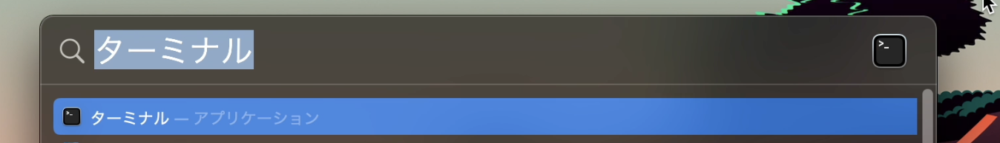
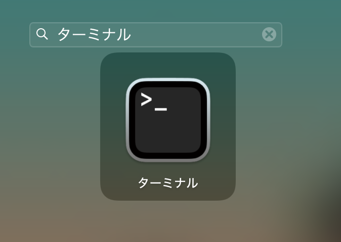

# html-css-js-curriculum

## リポジトリの利用方法

  
ダウンロード（Fork）して利用

1. 「Fork」を押す
   

2. 「Create Fork」を押す
   

3. Fork した「public-alchemy-curriculum」の「<> Code ▼ 」を押す
   

4. clone リンクをコピーする
   

5. ローカルでターミナルを開く（以下 2 つのどちらかの方法で行う）

   ① Spotlight で「ターミナル」と検索し開く
   

   ② Launchpad 内で「ターミナル」を検索し開く
   

6. ターミナルで`git clone git@github.com:XXXXXXXX/public-alchemy-curriculum.git`　を打ち込み、「ENTER」を押す

   ※ XXXXXXXX は Github のユーザネームが入ります

   ※ `git clone `の後に 4. でコピーしたものをペーストすると上記のコマンドになります

   

   ローカルに「public-alchemy-curriculum」フォルダが作成されていれば、clone が成功しています
   

## 課題を実施する前に下記内容を確認する

- [ディレクトリが作成されているか](https://www.notion.so/alchemy-inc/d39c7c0e8dce4ddfa049a1ea99e1e29f)
- 各課題の Issue が作成されているか（リポジトリの Issue タブを確認）
- Milestone が作成されているか（リポジトリの Issue タブから Milestone を押下）

## 課題について

コンテンツは 3 プログラム構成で実施していきます。

- `HTML-CSS`：全ての基礎となるマークアップを身につけるプログラムです。

- `JavaScript`：現代では必須となった JavaScript を現場ライクな形で学び、動的な処理や外部機能を利用し実装力をつけるプログラムです。

詳細はこちら [エンジニア育成プログラム・ファストス](https://www.notion.so/1f5483e3a0f249629a2f5ece97e2e4d1)

## 提出課題一覧
| 課題名　| 課題ページ |
--- | --- |
| 総合課題 | https://www.notion.so/alchemy-inc/5ec0700c11904471b256543deb79527f |
| 61(50+9+2)問課題 | https://www.notion.so/alchemy-inc/61-50-9-2-e2c27118d67c476c9aff2d162b662e40 |
| Flexレイアウト課題 | https://www.notion.so/alchemy-inc/Flex-e6153dfa277b4dbd9644e61a1dde5c7e |
| Gridレイアウト課題 | https://www.notion.so/alchemy-inc/Grid-09548d770e5a46d0b6c48515c8ae573a |
| CSS設計課題 | https://www.notion.so/alchemy-inc/CSS-ee7d8c15ee7144209b1abdd45a6b2d0c |
| 算術演算子 01~06 | https://www.notion.so/alchemy-inc/761fca9bcd644fe0b3453520eb5eab93 |
| 条件分岐 01~02 | https://www.notion.so/alchemy-inc/90c3e0d28f4d4f0d8b1e7952efa4e9f6 |
| 繰り返し処理 01~05| https://www.notion.so/alchemy-inc/8351b7912f7247a9895370b8a79235a8 |
| classとオブジェクト指向 | https://www.notion.so/alchemy-inc/class-30d8a348debb4da68717223fbbc3c86a |
| JSONデータの取り扱い(非同期処理) 01~02 | https://www.notion.so/alchemy-inc/JSON-5a402cc65c2448c79863cf9d0dfb3f2d |
| JS基礎の総合課題 01~03 | https://www.notion.so/alchemy-inc/JS-4eb8291c8d27414fb77abf801b83fd75 |

※ブランチ名は各課題ページで指定されています。ブランチ作成時に確認ください。

## 開発

課題の進め方は[github flow](https://atmarkit.itmedia.co.jp/ait/articles/1708/01/news015.html)で進めてください。

  
課題の進め方

- master ブランチから新規ブランチを切る
- 新規ブランチで実装を進める
- git で適宜コミット
- github に push
- github 上で PR を作って、レビュー実施
  - PR の書き方は[こちら](https://hydrakecat.hatenablog.jp/entry/2018/06/30/%E3%83%AC%E3%83%93%E3%83%A5%E3%83%BC%E3%81%97%E3%81%A6%E3%82%82%E3%82%89%E3%81%84%E3%82%84%E3%81%99%E3%81%84PR%E3%81%AE%E6%9B%B8%E3%81%8D%E6%96%B9)を参考に
- **研修生**がマージ

以下、下記の総合課題を例にして説明します。

https://www.notion.so/alchemy-inc/586e3d4481e44b339ce2c2c83591f9d0

1. 指定されたブランチ名(`html-general`)を確認し、ローカル環境でそのブランチを作成し、今のブランチからそのブランチに移動します。

- `git branch`とターミナルで打ち込み`Enter`を押し、現在のブランチを確認します。
  
  

- `git switch -c html-general`とターミナルで打ち込み`Enter`を押します。
- `git branch`とターミナルで打ち込み`Enter`を押し、`html-general`ブランチに移動しているか確認します。
  

2. 指定されたファイル(`general.html`)を修正します。

3. 修正したファイルをステージングに追加します。
   `git add html_learning/html/general.html` とターミナルに打ち込み`Enter`を押します。
   
4. ステージングされたファイルをコミットします。
   `git commit -v` とターミナルに打ち込み`Enter`を押します。
   ※`-v`オプションをつけることで自分が修正した差分の確認もすることができます。
   
  

5. コミットメッセージを打ち込みます。
   コミットメッセージは以下のリンクを参考にしてください。
   

今回の例では`feat:HTML総合課題の実装`としておきます。
保存したら × ボタンでコミットメーセージの Window を閉じます。

6. リモートリポジトリに変更をプッシュします。
   `git push origin html-general`とターミナルに打ち込み`Enter`を押します。
   

7. リモートリポジトリで PR(プルリクエスト)を作成します。

- `Compare & pull request`ボタンを押します。
  

- ブランチが`html-general`ブランチから`main`に向いていることを確認します
  ※ `base repository`、`head repository`の表記の箇所は赤い部分が自分のユーザ名になっているか必ず確認してください。
  

- PR の内容を記述します。
  ※コミットメッセージは実務を想定して他者から見てもらうことを意識して書くと勉強になります。
  
  

- `Create pull request` ボタンを押します。

8. `Merge pull request`ボタンを押し、セルフマージします。

